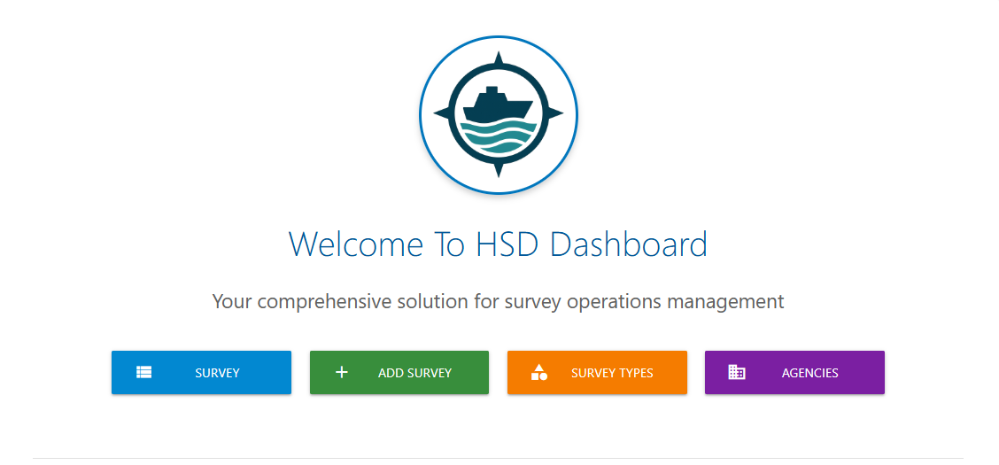

# HSD Dashboard

## What is HSD Dashboard ?
HSD Dashboard is a GeoDjango/PostGIS-powered application designed for the Hydrographic Survey Directorate in Bahrain. It provides a centralized platform to manage hydrographic survey operations, store and organize bathymetric and geospatial data, and monitor project progress. The dashboard integrates interactive mapping tools (Leaflet.js with OpenStreetMap and Esri layers) to visualize survey areas, polygons, and datasets in real time. With structured models for agencies, survey types, attributes, and operations, it enables streamlined data management, transparent tracking of activities, and efficient reporting across all marine survey projects.
## Why HSD Dashboard?
Managing hydrographic survey operations involves handling large volumes of geospatial data, multiple survey types, and progress tracking across different agencies and projects. Traditionally, this data is scattered across files, spreadsheets, and manual reports, making it difficult to maintain consistency, transparency, and efficiency. HSD Dashboard provides a unified solution: it centralizes survey data in a PostGIS-powered database, integrates interactive maps for visual clarity, and offers structured models for managing agencies, attributes, and operations. This ensures more accurate decision-making, faster reporting, and better oversight of Bahrain’s marine survey activities.
## Technologies Used?
- **Django / GeoDjango** – Web framework with geospatial support for building robust survey management applications.  
- **PostgreSQL + PostGIS** – Relational database with spatial extension for storing and querying geospatial data.  
- **Leaflet.js** – Interactive JavaScript mapping library for visualizing and editing survey polygons.  
- **OpenStreetMap & Esri Layers** – Basemaps for rendering and contextualizing marine survey areas.  
- **Python** – Core backend programming language for logic and data processing.  
- **HTML / CSS / JavaScript** – Frontend structure, styling, and interactivity.  
- **Materialize CSS** – Responsive UI framework used for clean and modern design.  
- **GDAL / OGR** – Geospatial libraries for data import, export, and transformation.  

## *References*
+ [Project GitHub Repo ](https://github.com/ibutaibeh/HSD_Dashboard)
+ [Project GitHub Trello](https://trello.com/b/TmGRmD7a/hsd-dashboard)

## What is Next?
- **Projects Dashboard** – High-level overview of all ongoing and completed survey projects.  
- **Import Data (XYZ format)** – Direct upload of XYZ bathymetric files.  
- **Import Shapefiles (SHP)** – Support for geospatial vector data import.  
- **Interactive Map Enhancements** – More advanced tools for visualization and editing survey polygons.  
- **Export Data by Query Set** – Flexible export of filtered datasets (CSV, GeoJSON, etc.).  
- **S-102 File Structures** – Structured storage aligned with IHO standards.  
- **S-102 Grid Details** – Generate and display detailed S-102 grid coverage for Bahrain’s waters.  
- **Mobile-Friendly Interface** – Optimized dashboard for tablets and field use.  
- **Notifications & Alerts** – Automated reminders for pending surveys, deadlines, or anomalies.